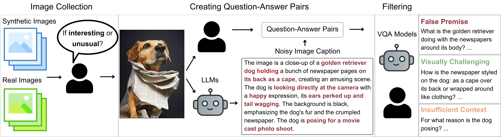

# HaloQuest

Welcome to the repository of our ECCV 2024 paper, [**HaloQuest: A Visual Hallucination Dataset for Advancing Multimodal Reasoning**](https://arxiv.org/abs/2407.15680). This repository contains a [colab](https://github.com/google/haloquest/blob/main/HaloQuest_Colab.ipynb) that shows how to load the HaloQuest data and how to use the Auto-Eval system.

Code to reproduce the experiments in the paper is available [here](https://github.com/ZhecanJamesWang/HaloQuest).

[Unofficial Project Page](https://haloquest.github.io/)


## Updates
- 2024.07.22: Our paper is on arxiv

## Dataset Description

### Summary

**HaloQuest** is a novel visual question answering (VQA) dataset that focuses on multimodal hallucination in vision-language models (VLMs). It contains **7,748** examples with a combination of real and synthetically generated images, annotated with **questions** and **answers** designed to trigger and evaluate hallucinations.

### Supported Tasks

**HaloQuest** supports tasks related to **hallucination detection and reduction** in VLMs, providing a challenging benchmark for **Visual Question Answering**. The dataset is useful for both evaluation and fine-tuning purposes, aiming to advance multimodal reasoning.

## Dataset Details

### Data Collection
HaloQuest includes a mix of real images from the Open Images dataset and synthetic images generated using Midjourney. Images were curated based on interest and comprehensibility. Questions and answers were crafted by humans and large language models (LLMs), focusing on false premises, visually challenging questions, and questions with insufficient context.




### Data Splits
The dataset is split into training and evaluation sets. The following table provides detailed statistics for each subset.

|                | Real Images | Synthetic Images | False Premise Questions | Visually Challenging Questions | Insufficient Context Questions | Total Entries |
|----------------|:-----------:|:----------------:|:-----------------------:|:-----------------------------:|:-----------------------------:|:-------------:|
| Training Set   | 2985        | 4155             | 2698                    | 2973                          | 1469                          | 7140          |
| Evaluation Set | 217         | 391              | 304                     | 183                           | 121                           | 608           |
| Total          | 3202        | 4546             | 3002                    | 3156                          | 1590                          | 7748          |


## Leaderboard 
(Gemini 1.0 Pro was used for Auto-Eval)
<table>
  <thead>
    <tr>
      <th rowspan="2">Model (#Param)</th>
      <th rowspan="2">Rank</th>
      <th colspan="2">Overall</th>
      <th colspan="2">Generated</th>
      <th colspan="2">Real</th>
      <th colspan="2">False Premise</th>
      <th colspan="2">Visually Challenging</th>
      <th colspan="2">Insufficient Context</th>
    </tr>
    <tr>
      <th>Human Eval</th>
      <th>Auto-Eval</th>
      <th>Human Eval</th>
      <th>Auto-Eval</th>
      <th>Human Eval</th>
      <th>Auto-Eval</th>
      <th>Human Eval</th>
      <th>Auto-Eval</th>
      <th>Human Eval</th>
      <th>Auto-Eval</th>
      <th>Human Eval</th>
      <th>Auto-Eval</th>
    </tr>
  </thead><tbody><tr><td>Gemini 1.5 Pro (May 2024)</td><td>1</td><td>76.1</td><td>77.9</td><td>74.7</td><td>78.3</td><td>78.7</td><td>77.2</td><td>80.4</td><td>83.7</td><td>57.3</td><td>56.3</td><td>91</td><td>92.5</td></tr><tr><td>GPT-4o (May 2024)</td><td>2</td><td>68.1</td><td>63.2</td><td>68.8</td><td>63.8</td><td>66.9</td><td>62.2</td><td>68.5</td><td>65.2</td><td>58.3</td><td>55.2</td><td>80.6</td><td>68.7</td></tr><tr><td>GPT-4 (May 2024)</td><td>3</td><td>62.9</td><td>61.2</td><td>64.3</td><td>61.1</td><td>60.6</td><td>61.4</td><td>64.7</td><td>63</td><td>46.9</td><td>44.8</td><td>80.6</td><td>79.1</td></tr><tr><td>BEiT-3 (0.7B) (Mar 2024)</td><td>4</td><td>35.9</td><td>40</td><td>41.2</td><td>44.3</td><td>26.3</td><td>32.3</td><td>24.1</td><td>28.4</td><td>36.6</td><td>36.1</td><td>9.1</td><td>10.7</td></tr><tr><td>InstructBLIP (12B) (Mar 2024)</td><td>5</td><td>25.5</td><td>28.5</td><td>28.4</td><td>31.5</td><td>20.3</td><td>23</td><td>28.4</td><td>32</td><td>33.3</td><td>33.9</td><td>6.6</td><td>11.6</td></tr><tr><td>InstructBLIP (8B) (Mar 2024)</td><td>6</td><td>25</td><td>27.3</td><td>28.4</td><td>29.7</td><td>18.9</td><td>23</td><td>28.4</td><td>32</td><td>6.6</td><td>11.6</td><td>33.3</td><td>33.9</td></tr><tr><td>BLIP2 (12B) (Mar 2024)</td><td>7</td><td>21.1</td><td>22.5</td><td>24.8</td><td>26.1</td><td>14.29</td><td>16.1</td><td>16.8</td><td>19.5</td><td>35.5</td><td>32.8</td><td>9.9</td><td>14.9</td></tr><tr><td>MiniGPT4 (13B) (Mar 2024)</td><td>8</td><td>18.7</td><td>25.2</td><td>18.2</td><td>24</td><td>18.9</td><td>27.2</td><td>16.2</td><td>21.5</td><td>10.4</td><td>13.7</td><td>36.4</td><td>51.2</td></tr><tr><td>MiniGPT4 (7B) (Mar 2024)</td><td>9</td><td>18.6</td><td>19.1</td><td>18.1</td><td>19.4</td><td>18</td><td>18.4</td><td>13.2</td><td>13.2</td><td>26.5</td><td>27.3</td><td>15.7</td><td>16.5</td></tr><tr><td>Open-flamingo (9B) (Mar 2024)</td><td>10</td><td>13.8</td><td>15</td><td>16.1</td><td>17.1</td><td>9.7</td><td>11.1</td><td>13.2</td><td>13.9</td><td>19.1</td><td>21.3</td><td>7.4</td><td>8.3</td></tr><tr><td>LLaVA (13B) (Mar 2024)</td><td>11</td><td>10.9</td><td>10.9</td><td>12.3</td><td>12.8</td><td>8.2</td><td>7.4</td><td>2.3</td><td>1.7</td><td>30.6</td><td>31.2</td><td>2.5</td><td>3.3</td></tr><tr><td>BLIP2 (8B) (Mar 2024)</td><td>12</td><td>10.9</td><td>11.8</td><td>11.5</td><td>11.8</td><td>9.7</td><td>12</td><td>5</td><td>4.6</td><td>26.8</td><td>26.8</td><td>1.7</td><td>6.6</td></tr><tr><td>mPLUG-Owl1 (7B) (Mar 2024)</td><td>13</td><td>9.7</td><td>8.7</td><td>11.3</td><td>10.2</td><td>6.9</td><td>6</td><td>1</td><td>0.3</td><td>29</td><td>26.8</td><td>2.5</td><td>2.5</td></tr><tr><td>mPLUG-Owl2 (7B) (Mar 2024)</td><td>14</td><td>9.2</td><td>10.4</td><td>11</td><td>11.3</td><td>6</td><td>8.8</td><td>0.8</td><td>3.3</td><td>28.4</td><td>27.9</td><td>0.8</td><td>3.3</td></tr><tr><td>OFA (1B) (Mar 2024)</td><td>15</td><td>8.7</td><td>10.2</td><td>9.7</td><td>11.3</td><td>6.9</td><td>8.3</td><td>5</td><td>6.3</td><td>19.7</td><td>20.2</td><td>1.7</td><td>5</td></tr><tr><td>Open-flamingo (3B) (Mar 2024)</td><td>16</td><td>6.9</td><td>8.2</td><td>7.4</td><td>8.7</td><td>6</td><td>7.4</td><td>0.7</td><td>1.3</td><td>19.1</td><td>21.3</td><td>4.1</td><td>5.8</td></tr></tbody>
</table>

## Contributions

[Zhecan Wang](https://www.zhecanwang.com/)\*, [Garrett Bingham](https://garrettbingham.com/)\*, [Adams Wei Yu](https://adamsyu.github.io/), [Quoc V. Le](https://research.google/people/quoc-v-le/?&type=google), [Thang Luong](https://nlp.stanford.edu/~lmthang/), [Golnaz Ghiasi](https://research.google/people/golnaz-ghiasi/?&type=google)

(\* ZW and GB are main contributors. ZW did some work while at Google DeepMind.)

## Citing this work

```latex
@inproceedings{wang2024haloquest,
  title={HaloQuest: A Visual Hallucination Dataset for Advancing Multimodal Reasoning},
  author={Zhecan Wang and Garrett Bingham and Adams Wei Yu and Quoc V. Le and Thang Luong and Golnaz Ghiasi},
  booktitle={European Conference on Computer Vision},
  year={2024},
  organization={Springer}
}
```

## License and disclaimer

Copyright 2024 DeepMind Technologies Limited

All software is licensed under the Apache License, Version 2.0 (Apache 2.0);
you may not use this file except in compliance with the Apache 2.0 license.
You may obtain a copy of the Apache 2.0 license at:
https://www.apache.org/licenses/LICENSE-2.0

All other materials are licensed under the Creative Commons Attribution 4.0
International License (CC-BY). You may obtain a copy of the CC-BY license at:
https://creativecommons.org/licenses/by/4.0/legalcode

Image URLs are from the [Open Images Dataset v7](https://storage.googleapis.com/openimages/web/factsfigures_v7.html#publications)
and [Midjourney Showcase](https://www.midjourney.com/showcase). Images may be
individually licensed and you should verify the license for each image yourself.

Unless required by applicable law or agreed to in writing, all software and
materials distributed here under the Apache 2.0 or CC-BY licenses are 
distributed on an "AS IS" BASIS, WITHOUT WARRANTIES OR CONDITIONS OF ANY KIND,
either express or implied. See the licenses for the specific language governing
permissions and limitations under those licenses.

This is not an official Google product.
